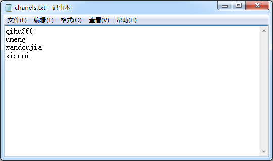
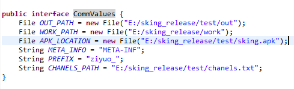

# ApkReleaseTool
##美团多渠道快速打包的Java实现##
参自：[美团Android自动化之旅—生成渠道包](http://tech.meituan.com/mt-apk-packaging.html)

观看本文之前请先看下[美团Android自动化之旅—生成渠道包](http://tech.meituan.com/mt-apk-packaging.html)，本文使用了美团所使用的批量打包方式的Java实现。注意是**只是一种Java实现**。

###用到的技术概述###
1. `AAPT命令`，本项目用于向apk包里面的`META-INF`写入文件。
2. `commons-io-2.2.jar`：本项目用于进行文件的`复制`和`删除`。
3. `策略设计模式`：为用户提供`渠道名`和`安装包名`，使用者可以自定义策略来生成新的发行包名。
4. Java的IO操作：读取记事本中的渠道列表。

###需要的素材
1. 记录所有需要打包的渠道名称。
2. 签名后的APP的应用安装包Apk。
3. 可以运行执行Java代码的的运行环境。

###实例##
1. 从PM那里拿到了部分渠道列表拿到四个渠道（将这些渠道名称拷入新建的记事本`chanels.txt`）以供演示。如图：



2. 用户可以配置发布前的apk路径、发行包输出目录等信息的配置。如图：

```java
package me.ziyuo.wang.tools;
import java.io.File;
public interface CommValues {
	File OUT_PATH = new File("E:/sking_release/test/out");
	File WORK_PATH = new File("E:/sking_release/work");
	File APK_LOCATION = new File("E:/sking_release/test/sking.apk");
	String META_INFO = "META-INF";
	String PREFIX = "ziyuo_";
	String CHANELS_PATH = "E:/sking_release/test/chanels.txt";
}
```

|   *配置Key*      |  *描述*  |

|   OUT_PATH     |发行包的输出目录|

|   WORK_PATH    |程序运行的工作目录，不可以和输入目录一致|

|   APK_LOCATION |发布前apk的路径|

|   PREFIX       |拷贝到META-INF文件中空文件的前缀|

|   CHANELS_PATH |存储渠道列表的txt文件路径|

3. 运行主程序，打好渠道的输出包会输出到配置的OUT_PATH目录下：

`E:\sking_release\work\qihu360\META-INF\ziyuo_qihu360
aapt a qihu360_sking.apk META-INF\ziyuo_qihu360
正常执行完  Command 命令。
删除工作目录:[E:\sking_release\work\qihu360]完成
E:\sking_release\work\umeng\META-INF\ziyuo_umeng
aapt a umeng_sking.apk META-INF\ziyuo_umeng
正常执行完  Command 命令。
删除工作目录:[E:\sking_release\work\umeng]完成
E:\sking_release\work\wandoujia\META-INF\ziyuo_wandoujia
aapt a wandoujia_sking.apk META-INF\ziyuo_wandoujia
正常执行完  Command 命令。
删除工作目录:[E:\sking_release\work\wandoujia]完成
E:\sking_release\work\xiaomi\META-INF\ziyuo_xiaomi
aapt a xiaomi_sking.apk META-INF\ziyuo_xiaomi
正常执行完  Command 命令。
删除工作目录:[E:\sking_release\work\xiaomi]完成`

4. 检查发行包输出目录中多渠道apk是否可以正常安装

**ok,到此多渠道打包的打包过程完成！**

***祝一切顺利！***

***by ziyuo Wang***


